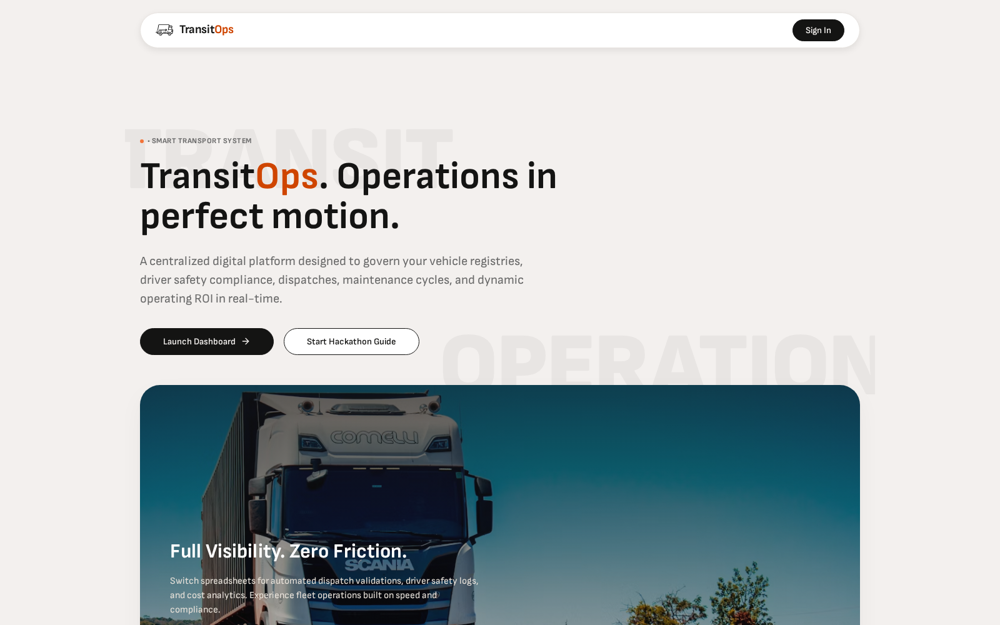
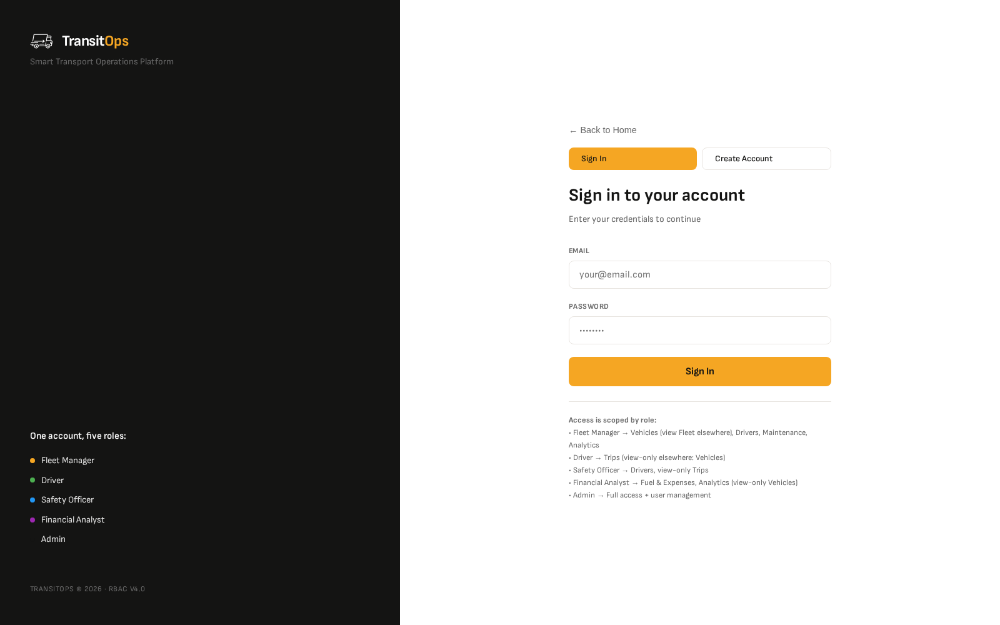
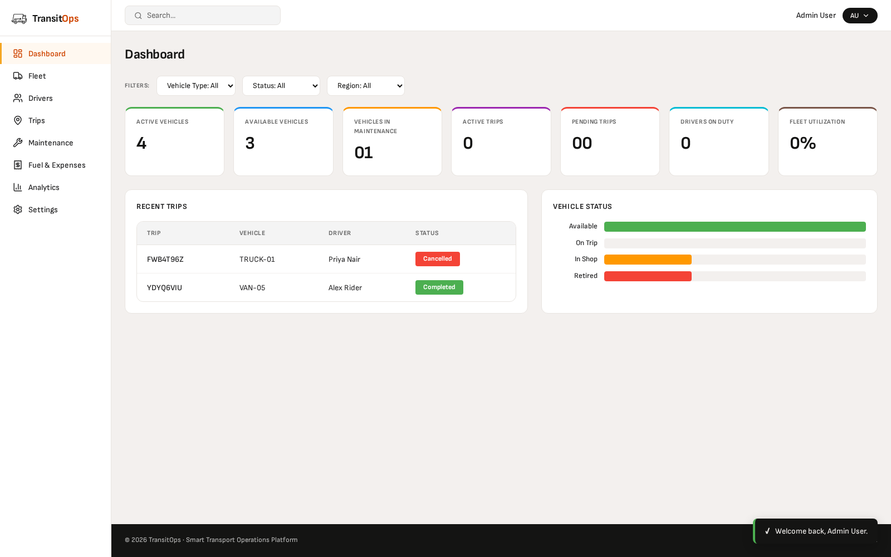
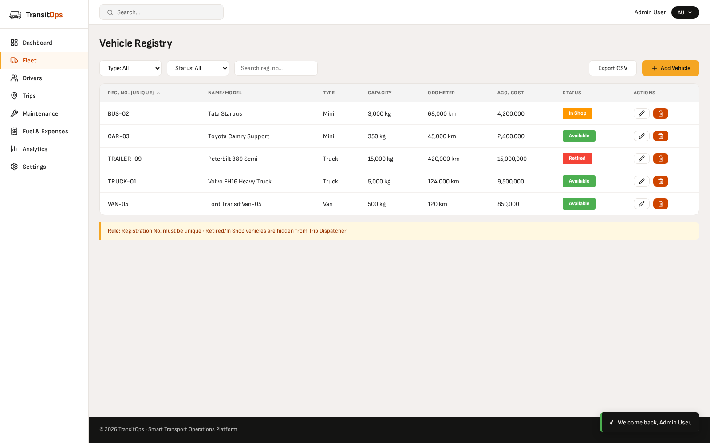
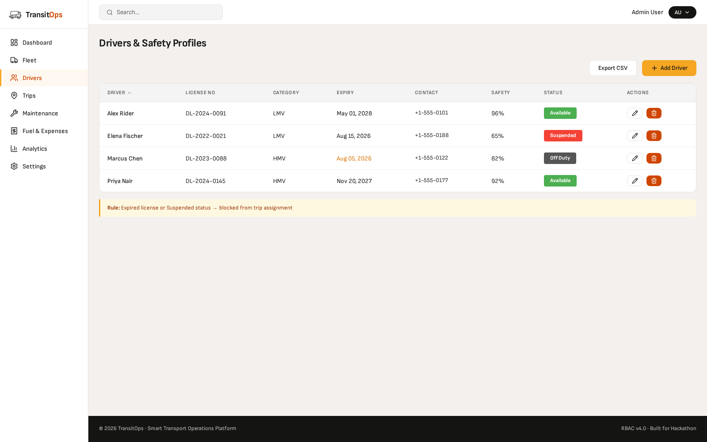
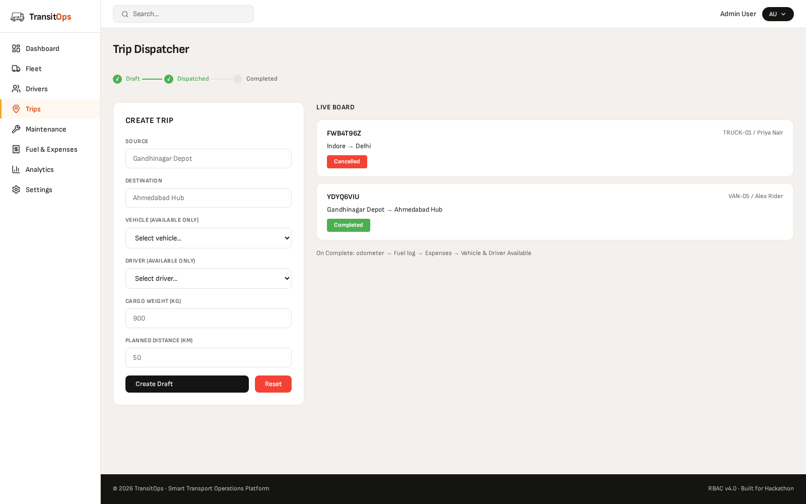
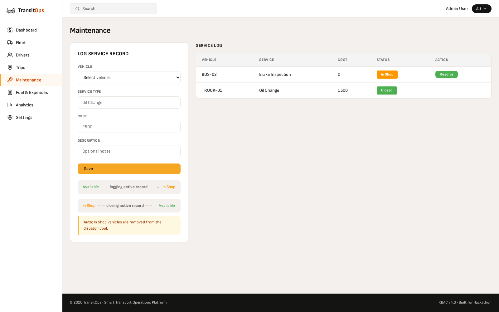
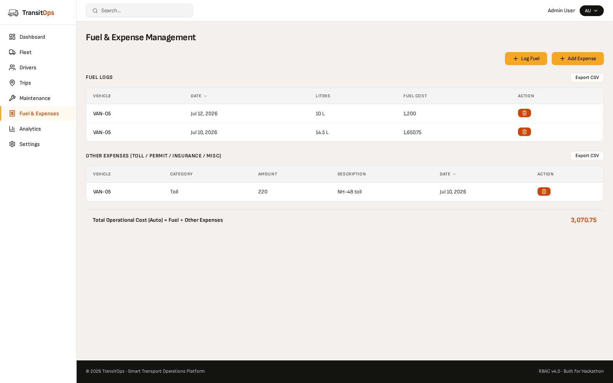
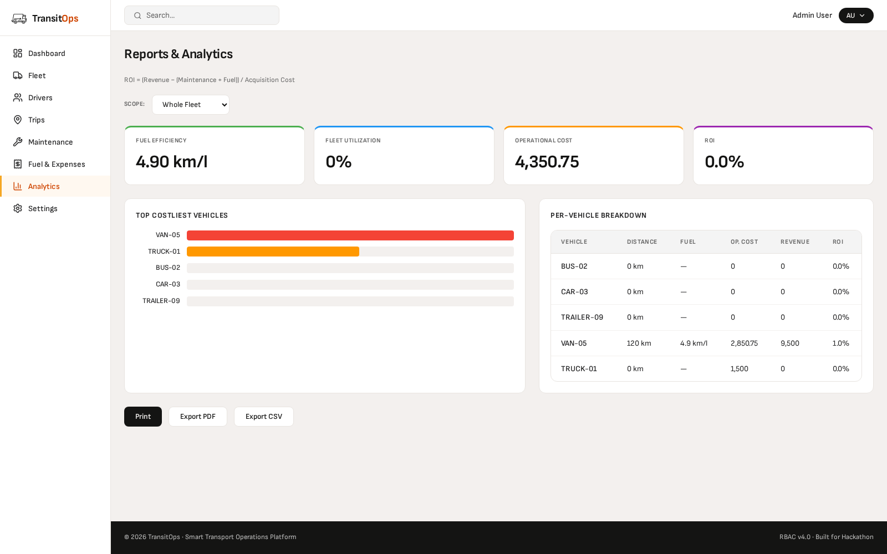
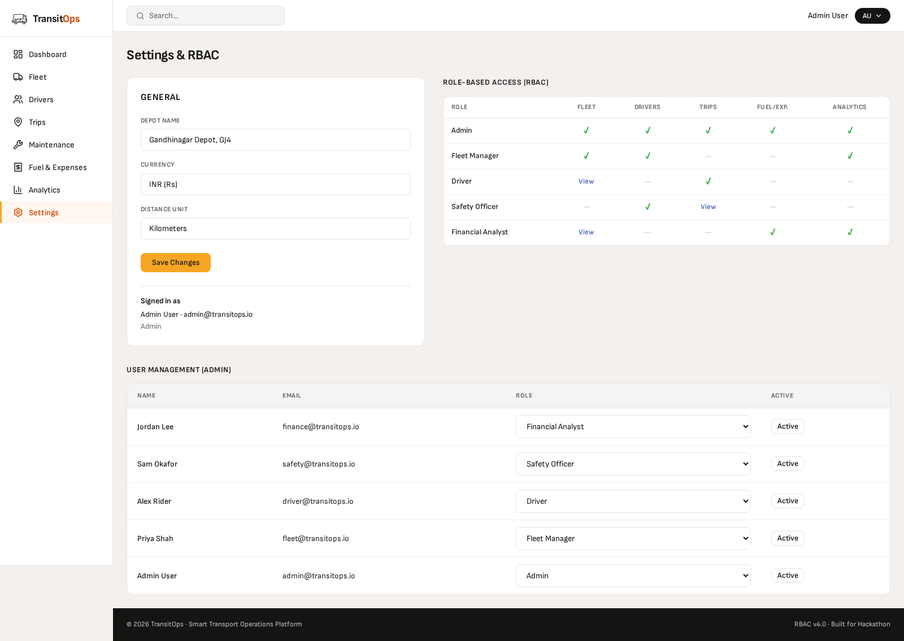

<div align="center">

# 🚚 TransitOps

### Smart Transport & Fleet Operations Platform

*Dispatch trips, lock down vehicle/driver availability automatically, log fuel & maintenance, and surface fleet ROI — all behind a 5-role RBAC layer.*

[](https://nodejs.org)
[](https://www.typescriptlang.org/)
[](https://expressjs.com/)
[](https://www.prisma.io/)
[](https://www.postgresql.org/)
[](https://react.dev/)
[](https://vitejs.dev/)
[](https://www.docker.com/)
[](https://jwt.io/)

</div>

---

## 📖 Table of Contents

- [What is TransitOps?](#-what-is-transitops)
- [Feature Highlights](#-feature-highlights)
- [Screenshots](#-screenshots)
- [Role-Based Access Control](#-role-based-access-control)
- [Architecture](#-architecture)
- [Tech Stack](#-tech-stack)
- [Project Structure](#-project-structure)
- [API Structure](#-api-structure)
- [Database Schema](#-database-schema)
- [How to Run](#-how-to-run)
- [Roadmap / Future Scope](#-roadmap--future-scope)
- [Team](#-team)

---

## 🧭 What is TransitOps?

Fleet operators juggle the same five questions every day: *which vehicle is free, who's driving it, is it costing more than it earns, when is it due for service, and is the driver even licensed to take it out?* TransitOps answers all five from one dashboard.

It's a full-stack **fleet & transport operations management system**: a hardened Express/Prisma API and a React SPA, wired together so that every trip, fuel fill-up, maintenance ticket, and expense automatically keeps vehicle and driver state consistent — no manual bookkeeping, no double-booked trucks.

- 🚐 **Vehicle registry** with load capacity, odometer, region, and lifecycle status, plus attached documents (RC, insurance, permits)
- 🧑‍✈️ **Driver profiles** with license expiry and a live safety score
- 🗺️ **Trip lifecycle engine**: `DRAFT → DISPATCHED → COMPLETED / CANCELLED`, with guardrails that block overweight cargo, expired licenses, and unavailable assets
- 🔧 **Maintenance workflow** that auto-flips a vehicle to `IN_SHOP` on open and back to `AVAILABLE` on close
- ⛽ **Fuel & expense ledgers** tied to vehicles (and optionally trips), owned by Financial Analyst
- 📊 **Computed KPIs** — Fuel Efficiency, Operational Cost, Vehicle ROI, Fleet Utilization — with CSV + PDF export
- 🔐 **5-role RBAC** (Admin, Fleet Manager, Driver, Safety Officer, Financial Analyst), each scoped to its own set of modules and enforced at the API layer, not just hidden in the UI
- 🔒 **Account lockout** after 5 failed logins, and **email notifications** (welcome + license-expiry reminders)

---

## ✨ Feature Highlights

| Module | Highlights |
|---|---|
| **Auth** | JWT bearer auth, bcrypt-hashed passwords, account lockout after 5 failed attempts, `/me` self-lookup |
| **Vehicles** | Registry with type/status/region filters, sorting, CSV export, capacity & odometer tracking, document uploads (RC/insurance/permits) |
| **Drivers** | License category + expiry enforcement, safety score, availability status, sorting, CSV export |
| **Trips** | State machine with automatic vehicle/driver locking & release, cargo-weight validation against vehicle capacity |
| **Maintenance** | Open/close tickets that drive vehicle status automatically |
| **Fuel Logs & Expenses** | Per-vehicle fuel fill-ups and tolls/fines/permits/insurance, owned end-to-end by Financial Analyst, sortable, CSV export |
| **Dashboard** | At-a-glance KPI cards, open to every role |
| **Reports** | Fuel Efficiency · Operational Cost · ROI · Fleet Utilization, exportable as CSV or PDF |
| **Notifications** | Welcome email on registration, daily license-expiry reminder job (logs to console if no SMTP is configured) |

---

## 📸 Screenshots

<div align="center">

| Landing Page | Sign In |
|---|---|
|  |  |

| Dashboard | Fleet |
|---|---|
|  |  |

| Drivers | Trips |
|---|---|
|  |  |

| Maintenance | Fuel & Expenses |
|---|---|
|  |  |

| Analytics | Settings |
|---|---|
|  |  |

</div>

---

## 🔐 Role-Based Access Control

Every route is gated by `requireAuth` + `requireRole(...)` middleware, on **both reads and writes** — a role with no access to a module gets a 403, not just a hidden button. The client mirrors the same matrix to hide nav tabs and actions a role can't use.

| Role | Fleet | Drivers | Trips | Fuel/Exp. | Analytics |
|---|---|---|---|---|---|
| **Admin** | ✓ | ✓ | ✓ | ✓ | ✓ |
| **Fleet Manager** | ✓ | ✓ | — | — | ✓ |
| **Driver** *(dispatcher persona)* | view | — | ✓ | — | — |
| **Safety Officer** | — | ✓ | view | — | — |
| **Financial Analyst** | view | — | — | ✓ | ✓ |

`✓` = full read/write, `view` = read-only, `—` = no access at all. Dashboard KPIs (the landing page) and Settings are open to every authenticated role; `/users` is Admin-only.

---

## 🏗️ Architecture

```
┌──────────────────┐        ┌───────────────────────┐        ┌──────────────────┐
│   React 19 SPA   │  REST  │   Express 5 API       │  SQL   │   PostgreSQL 16  │
│   (Vite + Nginx) │ ────▶ │   /api/v1/*  (JWT)    │ ─────▶ │   via Prisma ORM │
│   :5173 → :80    │  JSON  │   :4000               │        │   :5432          │
└──────────────────┘        └───────────────────────┘        └──────────────────┘
                                        │
                                        ▼
                              docker-entrypoint.sh
                          prisma migrate deploy → seed
```

Three containers, one Docker network, two named volumes (Postgres data + uploaded vehicle documents) — orchestrated entirely by [`docker-compose.yml`](./docker-compose.yml).

---

## 🛠️ Tech Stack

| Layer | Technology |
|---|---|
| **Frontend** | React 19, Vite 7, React Router-free SPA via tab state, Recharts (charts), Lucide (icons) |
| **Backend** | Node 24, Express 5, TypeScript, Zod (validation), JWT + bcryptjs (auth), Multer (file uploads), Nodemailer (email), PDFKit (PDF export) |
| **Database** | PostgreSQL 16, Prisma ORM 7 (`@prisma/adapter-pg`) |
| **Infra** | Docker, Docker Compose, Nginx (static client), multi-stage Alpine images |
| **Middleware** | Helmet, CORS, Morgan, cookie-parser |

---

## 📂 Project Structure

```
odoo2026/
├── docker-compose.yml   # 3-service orchestration: db · server · client
├── server/              # Express + Prisma REST API
│   ├── prisma/           # schema.prisma, migrations, seed.ts
│   └── src/
│       ├── modules/       # one folder per domain (routes/service/validation)
│       ├── middleware/    # auth, error, validate
│       ├── utils/         # ApiError, jwt, csv, pdf, mailer, params
│       └── jobs/          # license-expiry email job
└── Client/              # React + Vite SPA
    └── src/
        ├── api/            # one thin fetch-wrapper file per resource
        ├── context/        # AppContext — auth/session + RBAC state
        ├── components/     # Navbar, Footer
        ├── pages/          # Dashboard, Vehicles, Drivers, Trips, Maintenance,
        │                   # Expenses, Reports, Settings, Login/Landing
        └── utils/          # enums.js, shared formatters
```

Each backend module is self-contained (`*.routes.ts`, `*.service.ts`, `*.validation.ts`) — new domains slot in without touching existing ones.

---

## 🔌 API Structure

Base URL: **`/api/v1`** · Health check: `GET /health` (no prefix, no auth). Every route requires `Authorization: Bearer <token>` except `/auth/register` and `/auth/login`. Full endpoint-by-endpoint reference (methods, roles, request/response shapes) lives in **[`server/API.md`](./server/API.md)**.

| Resource | Base path | Owned by (per RBAC matrix) |
|---|---|---|
| Auth | `/auth` | Public login/register, `/me` for any authenticated user |
| Users | `/users` | Admin |
| Vehicles + documents | `/vehicles`, `/vehicle-documents` | Fleet Manager |
| Drivers | `/drivers` | Fleet Manager, Safety Officer |
| Trips | `/trips` | Driver |
| Maintenance | `/maintenance` | Fleet Manager |
| Fuel logs & expenses | `/fuel-logs`, `/expenses` | Financial Analyst |
| Dashboard | `/dashboard/kpis` | Any authenticated role |
| Reports | `/reports/overview` (`?format=csv\|pdf`) | Fleet Manager, Financial Analyst |

List endpoints support pagination, filtering, `sortBy`/`sortOrder`, and (except maintenance) `?format=csv`. Every mutating route runs through a Zod schema in `*.validation.ts` before it touches the database.

---

## 🗄️ Database Schema

Modeled with Prisma on PostgreSQL — full column-level reference lives in **[`server/schema.md`](./server/schema.md)**. Entities: `Users, Vehicles, VehicleDocuments, Drivers, Trips, MaintenanceLogs, FuelLogs, Expenses`.

```
User ──< Driver (optional 1:1)        Vehicle ──< Trip
User ──< Trip / MaintenanceLog        Vehicle ──< MaintenanceLog / FuelLog / Expense
User ──< FuelLog / Expense            Vehicle ──< VehicleDocument
User ──< VehicleDocument              Driver  ──< Trip
                                      Trip    ──< FuelLog (optional)
```

Two enums were simplified to match what the product actually uses: `VehicleType` is just `TRUCK | VAN | MINI | OTHER`, and `Vehicle.region` is a fixed `Region` enum (`NORTH | EAST | SOUTH | WEST`) instead of a freeform string.

**Derived KPIs** (computed in `modules/reports`, not stored columns):

| Metric | Formula |
|---|---|
| Fuel Efficiency (km/L) | `Σ Trip.actualDistanceKm / Σ FuelLog.liters` |
| Operational Cost | `Σ FuelLog.cost + Σ MaintenanceLog.cost` |
| Vehicle ROI | `(Σ Trip.revenue − Operational Cost) / Vehicle.acquisitionCost` |
| Fleet Utilization % | `count(status = ON_TRIP) / count(status ≠ RETIRED) × 100` |

---

## 🚀 How to Run

```bash
git clone <this-repo-url> && cd odoo2026
docker compose up --build -d
```

That's it — Postgres, the API, and the SPA all come up together, with migrations and demo data applied automatically on first boot. No `.env` file is required; every variable in `docker-compose.yml` falls back to a sane local default (rotate `JWT_SECRET` and set the `SMTP_*` vars before deploying anywhere real).

| | URL |
|---|---|
| **Frontend (SPA)** | http://localhost:5173 |
| **Backend (API base)** | http://localhost:4000/api/v1 |
| **Health check** | http://localhost:4000/health |

### Tear down

```bash
docker compose down          # stop containers, keep the pgdata + uploads volumes
docker compose down -v       # also wipe the database and uploaded documents
```

### Demo accounts

Seeded by [`server/prisma/seed.ts`](./server/prisma/seed.ts) — all five share one password.

| Email | Role | Password |
|---|---|---|
| `admin@transitops.io` | ADMIN | `Password123!` |
| `fleet@transitops.io` | FLEET_MANAGER | `Password123!` |
| `driver@transitops.io` | DRIVER | `Password123!` |
| `safety@transitops.io` | SAFETY_OFFICER | `Password123!` |
| `finance@transitops.io` | FINANCIAL_ANALYST | `Password123!` |

Log in as each one to see how the nav, pages, and permissions shift per role.

---

## 🗺️ Roadmap / Future Scope

- [ ] **Immutable fuel-log/expense audit trail** — currently Financial Analyst can delete a fuel log or expense after the fact, silently skewing reports; move toward soft-delete + change history
- [ ] **Clarify maintenance ownership** — decide whether Fleet Managers should close tickets independently of Admin, or require sign-off
- [ ] **Object storage for vehicle documents** — swap the local-disk/Docker-volume upload for S3-compatible storage in production
- [ ] **Automated test suite** — unit tests for trip-guardrail logic, integration tests per module
- [ ] **CI/CD pipeline** — lint + build + migration dry-run on every PR
- [ ] **Real-time trip updates** — WebSocket/SSE push when a trip is dispatched/completed instead of polling
- [ ] **Driver mobile PWA** — a lightweight, offline-tolerant view for drivers to dispatch/complete their own trips
- [ ] **Multi-tenancy** — scope vehicles/drivers/trips to an organization for SaaS-style deployment

---

## 🤝 Team

| Name |
|---|
| Abhishek Verma |
| Anurag Verma |
| Aditya Sharma |

---

<div align="center">

Built with Express, Prisma, React, and a healthy amount of `docker compose up`.

</div>
